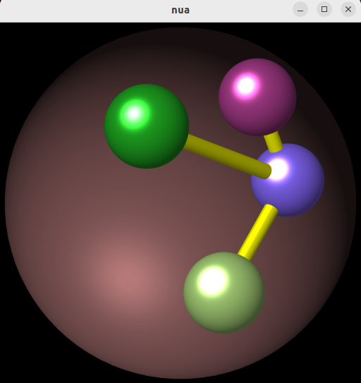
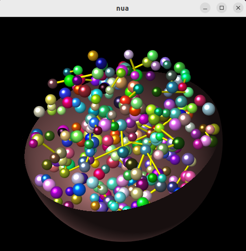
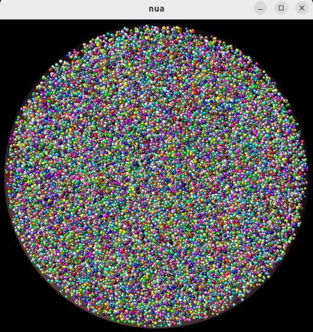

# nua - nucliard - a nuclei billiard


<p align="middle">
  
  
  
</p>


Nucleard or nua is an *in-early-development* C-library for 3D
rendering of markers and links with individual colors and radii. I
intend to use nua for real time monitoring of simulations, for example
in [chromflock](https://github.com/elgw/chromflock). It can also be
used to show chimera marker files (.cmm) with limited/experimental
support. In all cases I recommend the excellent [UCSF
Chimera](https://www.cgl.ucsf.edu/chimera/) instead of this library
unless you are really craving for a c-library. If so, check back later
to see if this project has matured (if the to-do-list is shorter and
less scary). I'm totally new to Vulkan so _don't_ browse the code for
*best practices*.

Chimera has way more features (use it!) but is also more resource hungry.
 - Install size: chimera: > 500 MB, libnua+nuademo: < 0.3 MB
 - When rendering 4 M beads from a cmm file, chimera used 32 GB RAM and 353 MiB GPU
   memory. It took  > 2 min to get up the graphics on screen..
 - nuademo loaded the same file in 9 s, used 0.7 GB of
   RAM and 132 MiB of GPU memory.
 - RAM usage was measured by `cat /proc/<PID>/status | grep VmPeak`
   and GPU Memory usage from `nvidia-smi`.
 - Both chimera and nua use about 0% CPU and GPU when the graphics
   isn't updating.

Some overall goals for this project are:
 - Keep the resource usage low.
 - Be easy to integrate.
 - Support both Mac and Linux (yet to be adapted for mac).
 - Eventually, provide a stable API and some documentation (TODO).
 - Only rely on packages from the Ubuntu Package archive (i.e. that
   can be installed with **apt**, kazmath does not fulfill that at the moment and is hence compiled into the library).

The implementation uses
[SDL2](https://www.libsdl.org/) which in turn uses
[Vulkan 1.3](https://www.vulkan.org/) for the graphics.
Linear algebra is handled by
[Kazmath](https://github.com/Kazade/kazmath)
and chimera marker files are parsed by libxml2.

## Example usage

For a complete example, see **nuademo.c** where *nua* is used to
monitor some toy calculations running in a separate thread (Brownian
motion without collision detection). When the Brownian step length is
set to 0 (starts at 0, increases with 't' and decreases by 'g') the
computations are paused and the CPU usage is close to 0%.

``` C
    nua_t * nua = nua_new();

    /* add custom user interactions
     * point to your data
     */
    nua->user_handle = my_ui;
    nua->nbeads = ...;
    nua->bead_data = ...;

    /* Start your calculations in a thread
    * update graphics with nua_data_changed
    */
    ...

    /* Show the window, user interactions enabled
    * this call will block until the window is destroyed
    */
    nua_run(nua);

    nua_destroy(nua); /* Free up */

    /* Stop your calculations */
    ...
```

For an example of how to use the library, once installed, see the folder **minimal_demo**.

## Build and install

Only tested on Ubuntu 22.04.01 LTS so far.

### Dependencies
Besides installing gcc etc this was needed:

``` shell
sudo apt-get install libsdl2-dev libsdl2-image-dev
sudo apt-get install vulkan-validationlayers
# for shader compilation with glslangValidator
sudo apt install glslang-tools
```

### Build and run the demo

``` shell
make
LD_LIBRARY_PATH=LD_LIBRARY_PATH:`pwd`
./nuademo --help
```

### Build the library as deb package and install it

``` shell
make
./makedeb
sudo apt-get install ./libnua_0.0.2_amd64.deb
# To un-install, use
# sudo apt-get remove libnua
```

## Development status

At the moment it does what I want it to do. Possible improvements and new
features could include:

 - [ ] Read data from csv files.
 - [ ] Add a keyboard shortcut to pause uploading new data to the GPU.
 - [ ] Adopt viewport to data (currently only views a unit cube).
 - [ ] FPS limiter, only update data/redraw every m ms.
 - [ ] One model matrix per model :)
 - [ ] Add a `NUA_OBJECT_GENERAL` for any mesh ... would make nua a
      little more useful as a library.
 - [ ] Proper Phong lighting
 - [ ] Enable fillModeNonSolid: `VkPhysicalDeviceFeatures->fillModeNonSolid is false. The Vulkan spec states: If the fillModeNonSolid feature is not enabled`
 - [ ] Light intensity that depends on the distance to the eye.
 - [ ] Steal some ideas from chimera, especially look at their shaders in `UCSF-Chimera64-1.14/share/Shaders/`.
 - [ ] animate / auto-rotate?
 - [ ] Switch to more refined bead model on zoom-in?
 - [ ] Improve GUI (explode view, etc ...)
 - [ ] Add some text rendering, possible libraries unless it is done directly in Vulkan:
       [LibGD](https://libgd.github.io/),
       [cairo](https://www.cairographics.org/) or simply what is
       already in
       [SDL2](https://stackoverflow.com/questions/43414600/unexpected-behavior-while-using-sdl-image-for-texture-in-vulkan)?
 - [ ] run without MSAA? Also check out [FXAA](https://github.com/DadSchoorse/vkBasalt)
 - [ ] Only draw half+ spheres and orient them to face camera to save on faces/vertices
 - [ ] Mouse coordinates as uniform? For some fun ....
 - [ ] Smarter GPU selection on multiple-GPU systems.

If you plan to play with the code It might make sense to install the SDK from
[lunarg](https://vulkan.lunarg.com/sdk/home#linux) for extra validation
layers (which you would have to enable manually).

## References
 - [shadergif.com](https://shadergif.com/) and [shadertoys.com](https://shadertoy.com/) for fun and smart shaders.
 - [learnopengl.com](https://learnopengl.com/Introduction) for OpenGL reference material.
 - [RenderDoc](https://renderdoc.org/) For debugging, looks useful at a later stage.
 - [GameDev Pensieve](https://www.gamedevpensieve.com/graphics/api/api_stateless/api_vk) for a larger collection of links.
 - [https://vulkan-tutorial.com/] recommended Vulkan tutorial.
 - [https://vkguide.dev/] another Vulkan tutorial.
 - [https://github.com/KhronosGroup/Vulkan-Samples] the Vulkan sample collection.

Libraries:
 - [SDL2](https://www.libsdl.org/)
 - [Vulkan](https://www.vulkan.org/)
 - [Kazmath](https://github.com/Kazade/kazmath) partly included among the source files in this repo.
 - [libxml2](https://gitlab.gnome.org/GNOME/libxml2)
